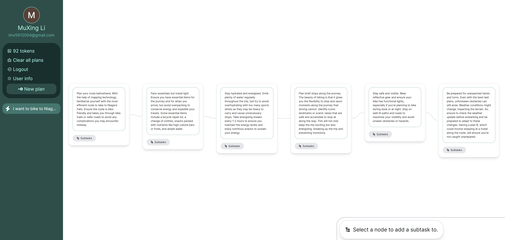

## Inspiration

🌱 As humans, our ability to solve problems calls for a plan that grows in complexity as the task does. Most importantly, a plan must be envisioned for it to become scalable and successful.

🤖 Now what if this foundational step were to be automated? By harnessing the power of AI, seePickle gets your ideas up and running by generating a base on which your plans can scale.

## What it does

🥝 "Node" based plan generation

- Prompt seePickle the objective of your plan, and it will create a plotted approach for accomplishing your goal(s).
- For the "Developer" and "Academia" plan types, seePickle can fetch online resources for you to follow along.

👥 Plan assistance

- For each task, seePickle's assistant can help you with things such as managing costs to generating additional subtasks.

## Technology

   

[seePickle uses the Cohere API for response generation.](https://cohere.com/)

[seePickle uses Auth0 for user identity management.](https://auth0.com/)

## What's next for seePickle

⚡ Integration with third party applications
